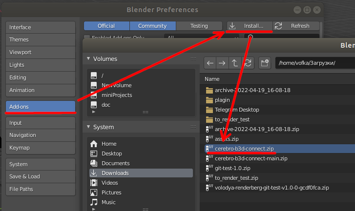
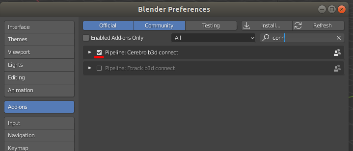

.. _install-page:

Установка
=========

* Архив плагина `качаем тут <https://www.notion.so/propls/f2d0231e8acf49c1b67a0cc7d255fe04#08ee0ff3790e48539d6cd3202aa3032c>`_

* Запускаем *Preferences Editor* в блендере.
	
	* :guilabel:`Addons` -> :guilabel:`Install` -> выбираем в проводнике загруженный архив.

* После установки плагин надо активировать.

* При первой же аутентификации плагин предложит обновится, на что надо согласиться и после завершения обновления перезапустить блендер.