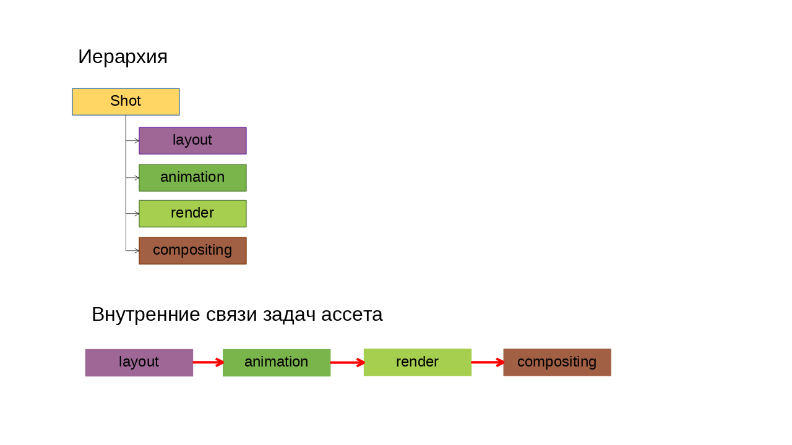
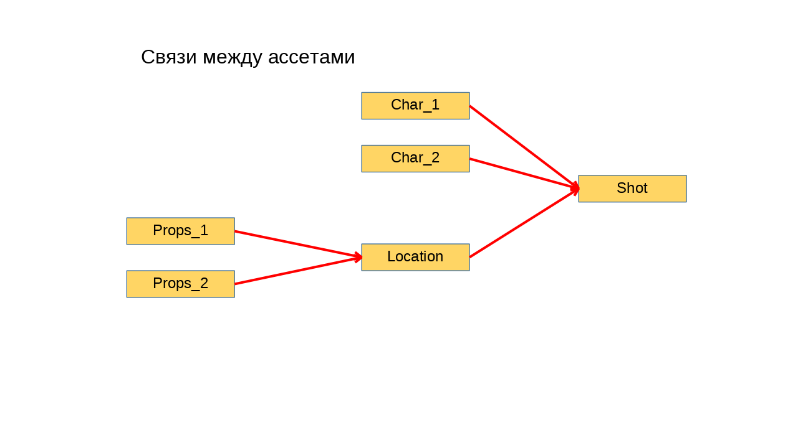
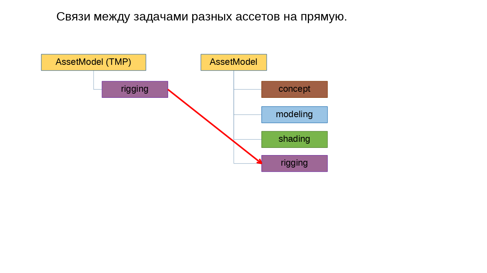

.. _links-of-tasks-page:

Взаимосвязи задач
===================

Связи между задачами устанавливаются менеджерами проектов в деск топ клиенте серебры.

Каждая связь устанавливается между двумя задачами.

Ассеты и задачи
----------------

Для серебры все задачи идентичны, но плагин в зависимости от видов деятельности по разному характеризует типы объектов и по разному обрабатывает эти связи.

* **Ассеты** задачи с видами деятельности: **AssetModel**, **Location**, **Shot**, **Episode**. название вида деятельности с заглавной буквы.

* **Задачи** задачи с видами деятельности: **rigging**, **layout**, **animation** ... итд. название вида деятельности с маленькой буквы.

Связи внутри ассета
--------------------

Ассеты имеют дочернии задачи, которые являются пайплайн шагами по созданию данного ассета, и соответственно между этими задачами создаются последовательные связи.

.. note:: Эти связи используются при открытии сцены из входящей задачи :ref:`selected_panel_open_from_incoming`.

.. note:: Дочерние задачи Ассетов не должны иметь дочерних задач, если это задачи по работе с 3д сценами.

Связи между ассетами
--------------------

Связываются Ассеты напрямую.

Примеры связей между ассетами: 

   * Пропсы с локацией

   * Локация с шотом

   * Персонажи с шотом.

.. note:: Эти связи используются при билде.

Особенности для связи ассетов в плагине:

* Для всех действий будет выбираться дочерняя задача ассета, которая будет определятся по виду деятельности. Поиск из списка видов деятельности в приоритете на убывание: ``layout``, ``rigging``, ``shading``, ``modelling``, ``concept``.

* Данная входящая связь будет видна для всех задач ассета.

Связи между задачами из различных ассетов
------------------------------------------

Такие связи используются в основном для подгрузки каких либо компонент из шаблонов и прочих исходников.

Например: 

* прототипа рига для всех персонажей.
* создание объекта на основе другого, какой либо вариант.

