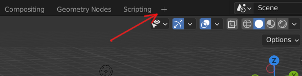
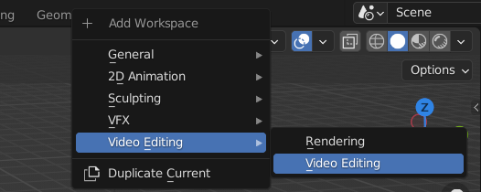
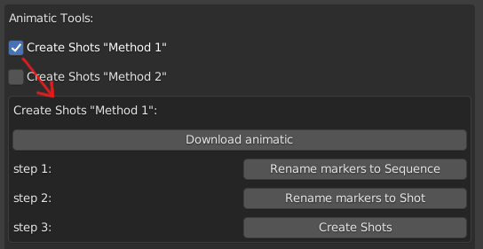
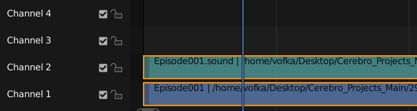
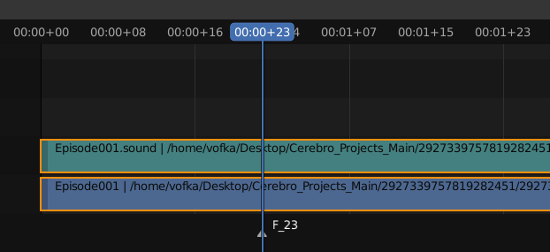
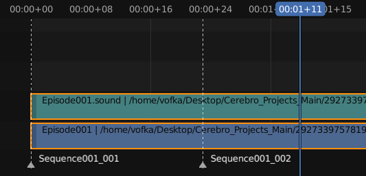
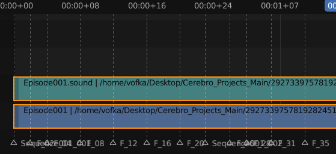
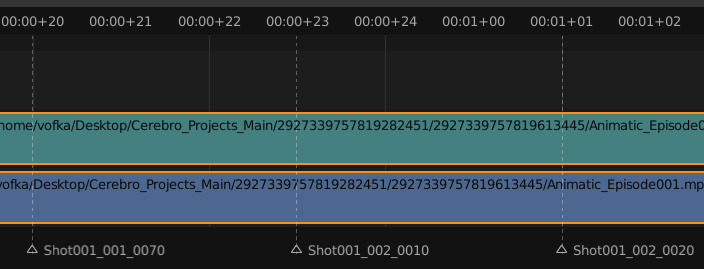
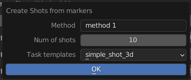
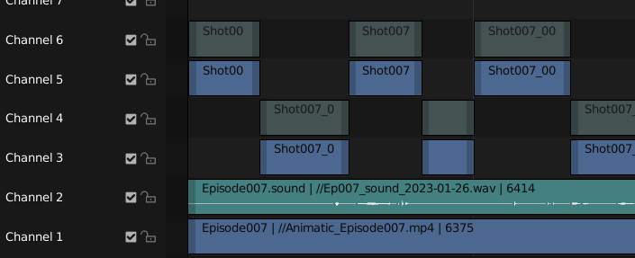

.. _slicing-page:

Нарезка аниматика на шоты Method_1
===================================

Первичная нарезка аниматика на шоты.

* Используется общий видеофайл аниматика серии, который был создан любым способом.
    * фпс данного видеофайла должен совпадать с фпс проекта.
* Автоматически будут созданы ассеты шотов этой серии.
    * Ассеты шотов будут создаваться в папке **Shots**, которая будет создана или найдена на одном уровне с ассетом эпизода.
    * Для каждого шота будут созданы из загружены на сервер соответствующие видеофрагменты аниматика.
    * Для каждого шота будет записан в праметры ассета временной диапазон.

Рабочее пространство
---------------------

Для данного процесса выбирается рабочее пространство **Video Editing**

Клик по плюсику

Далее **Video Editing** / **Video Editing**

Включение панели
-----------------

Панелька включается галочкой **Create Shots "Method 1"** в **Animatic Tools**

Панель содержит Конпку :guilabel:`Download Animatic` и кнопки трёх шагов.

Загрузка аниматика
-------------------

Аниматик должен занимать только первые две дорожки севенсора.
Загружать файл вручную на дорожки секвенсора не рекомендуется. Лучше это делать специальной кнопкой.

кнопка :guilabel:`Download Animatic` - загрузка видеофайла на нужные дорожки через открываемый проводник, плюс выставление настроек сцены.

Подробнее тут :ref:`animatic_tools_download_animatic`

Три шага
----------

Данные шаги выполняются только один раз. По завершении будут готовы все ассеты шотов и созданы фрагменты аниматиков шотов.

Step 1:
~~~~~~~~

Разметка границ секвенций серии.

* Границы размечаются маркерами в **Sequence Editor**.
    * Маркеры создаются на границе секвенций.
    * Маркер с самом первом кадре серии ставить не обязательно.
    * Если в серии всего одна секвенция, то маркеры ставить не надо вообще, а сразу жмём кнопку.
* Создание маркера: в нужном месте временной шкалы ставится текущий кадр, и при нахождении курсора в области **Sequence Editor** делается клик по 
    латинской **M**. Возникает маркер с названием по номеру текущего кадра.
    
    * Маркеры можно выделять, перемещать в стороны и удалять.

После того как все маркеры созданы

клик по кнопке :guilabel:`Rename markers to Sequence`
это переименует маркеры по названиям секвенций, а так же создаст маркер самой первой секвенции.

Делаем :ref:`work_panel_commit` с коментарием: **Sequences markers**

Step 2:
~~~~~~~~~

Разметка границ шотов серии.

* Границы шотов так же размечаются маркерами.
* Маркеры ставятся на границе шотов, там где на границе шотов уже есть маркер секвенции, больше ничего ставить не нужно.
* Надо ставить маркер в самом последнем кадре серии. Это лечение одного бага.
* имена маркеров не трогаем.

Работа кропотливая и нудная, по чаще сохраняемся.

После того как будут выставлены все маркеры на границах шотов

клик по кнопке :guilabel:`Rename markers to Shot`
это переименует маркеры по названиям шотов. В названии будут отражены и номер эпизода и номер секвенции.
Отанутся только имена шотов - имена маркеров секвенций из прошлого шага так же будут трансформированы в названия шотов.

Делаем :ref:`work_panel_commit` с коментарием: **Shots markers**

Step 3:
~~~~~~~~~~

Создание шотов.

Шоты создаются по существующим маркерам. Временной диапазон шота выставляется от текущего до следующего маркера.
После создания шота его маркер удаляется. Поэтому использование маркеров в данной процедуре одноразовое.

Делается клик по кнопке :guilabel:`Create Shots`

Это запустит панельку где надо будет указать:

* количество создаваемых шотов **Num of Shots**
    * учитывая что процесс может оказаться длительным и не стабильным, создавать все шоты за раз не рекомндуется, 
        можно использовать число, которое стоит по умолчанию - 10. Число должно быть чётным.
* шаблон ассета **Task templates**, которрый будет использоваться при создании ассета.

Далее по клику по :guilabel:`Ok` начнут создаваться шоты, делаться плейбласты, всё это будет выгружаться на сервер.

После отвиса кнопки появятся секвенции созданных шотов, которые будут занимать с 3 по 6 дорожки секвенсора змейкой, если 
процесс не упадёт, то файл будет автоматически сохранён. и можно будет создавать следующие шоты.

И так до конца.

Делаем :ref:`work_panel_commit` с коментарием: **Create Shots**