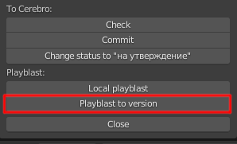
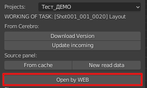

.. _animation-page:

Анимация
===========

.. _animation_pull_task:

Взятие задачи в работу
------------------------

* Для анимации справедливо всё что описано в общем разделе во :ref:`common_pull_task`

* Но есть некоторые дополнения:

.. _animation_pull_task_from_null:

От нуля
~~~~~~~~

.. note:: нет ни глобальных, ни локальных версий, нет ни каких данных из входящих задач данного шота.

* Надо собрать сцену из компонентов по входящим связям (локация, персонажи):

    * найти и выбрать задачу в :ref:`tasks-list-page`, после чего кликнуть по кнопке :guilabel:`select` напртив имени задачи (:ref:`tasks_list_select_button`)

    * в открывшейся панеле найти и кликнуть кнопку :guilabel:`Update incoming` (:ref:`selected_panel_update_incoming`) - эта процедура соберёт конент данного шота (локация, персонажи) на ваш локальный комп. 

    .. note:: Если данная процедура уже выполнялась для другого шота, который имеет тот же контент, или вы уверены, что контент уже загружен - то этот шаг можно пропустить. Проверить наличие и свежесть контента можно по кнопке :guilabel:`Sources panel` (:ref:`selected_panel_source_panel`)

    .. note:: Данная процедура довольно длительная, надо будет подождать пока отвиснет кнопка.

    * Выполнить сборку сцены функцией :ref:`build-scene-page`

        .. attention:: Внимательно посмотрите видео к этой функции, есть критические особенности.

    * По окнчании сборки взять в работу текущую сцену :ref:`selected_panel_current_scene_to_work`.

* Загрузить аниматик по кнопке :guilabel:`Download animatic` (:ref:`animation_tools_download_animatic`)
    
.. _animation_pull_task_from_incoming:

Открыть из входящей
~~~~~~~~~~~~~~~~~~~~~

.. note:: нет версий данной задачи, но существуют версии входящей задачи этого же ассета, например есть **animation**, а мы в задаче **render**.

* взять в работу сцену из входящей задачи :ref:`selected_panel_open_from_incoming`

    .. note:: учитывая что входящая задача шота является составным объектом из локации, её контента и персонажей - при её остутствии ``missing``, или при статусе ``old`` не обязательно запускать :ref:`selected_panel_update_incoming` потому что данная процедура будет выполнять проверку наличия содержимого не только файла данной задачи, но и каждого компонента локации и каждого персонажа. Если вы уверены, что все компоненты уже ранее были загружены, то в данном случае проще загрузить только недостающий файл через :ref:`work_panel_source_panel` выполнив :guilabel:`Reload version`.

Отправка отчёта
-----------------

* Отправка в серебру плейбласта + версии рабочего файла - :ref:`work_panel_playblast_playblast_to_version` с коммитом.

Общение в чате по задаче
--------------------------

* **web** чат по задаче открывается кнопкой :guilabel:`Open by web` - :ref:`work_panel_open_last_commit_by_web`

