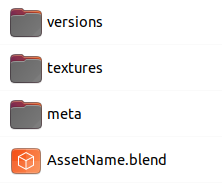

.. _files-page:

Локальная файловая структура
=============================

Общее
-------

* Основным местом хранения считается облачное хранилище.

* Локальная файловая структура создаётся плагином автоматически в директории **Cerebro_Projects_Main**, место для которой определяется в настройках :ref:`projects_folder_settings`.

.. _files_task_folder:

Директория задачи
------------------

.. _files_task_folder_path:

Путь до директории задачи
~~~~~~~~~~~~~~~~~~~~~~~~~~~~

foo_path/**Cerebro_Projects_Main**/``project_id``/``task_id``/

.. _files_task_folder_structure:

Состав директории задачи
~~~~~~~~~~~~~~~~~~~~~~~~~~~

* служебные директории (состав может различаться от типа задачи).
* рабочий файл по имени ассета - **топ версия**:
	* *топ версия* открывается по кнопкам :ref:`selected_panel_open` или :ref:`check_selected_panel_look`,
	* *топ версия* перезаписывается открываемой версией при выполнении :ref:`selected_panel_open_version` или :ref:`check_selected_panel_look_version`,
	* на *топ версию* ссылаются *линки* контента сцены.
* дополнительные файлы, аниматик для шота и прочее.

.. _files_task_folder_packing:

Что упаковывается в архив версии
~~~~~~~~~~~~~~~~~~~~~~~~~~~~~~~~~~~

При выполнении :ref:`work_panel_commit` создаётся архив в который упаковывается:

* служебные директории.
* *топ версия* рабочего файла.

всё остальное игнорируется.