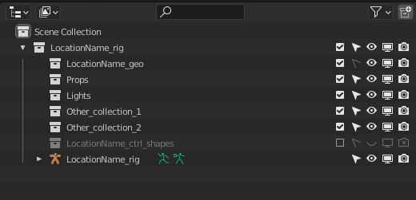

.. _location-page:

Сборка локации
================

`Сборка локации через Build (видео) <https://disk.yandex.ru/i/w61Re-V6TAbGcg>`_

.. attention:: Сборка и пересборка локации через билд пока не применима если в локации используются инстансы коллекций.

`Штучное добавление пропсов через Source Panel (видео) <https://disk.yandex.ru/i/v7CENRmOYLSTeA>`_

Тех требования
----------------

Иерархия сцены локации
~~~~~~~~~~~~~~~~~~~~~~~

Главные коллекции
******************

#. ``root`` коллекция. Название должно быть ``[AssetName]_rig``.

    #. Только эту коллекцию забирает билд.

    #. Команда для переименования ``root`` коллекции:

        .. code-block:: python

            import os; bpy.context.collection.name=f"{os.environ['CEREBRO_B3D_CURRENT_ASSET_NAME']}_rig"

        * выделяется коллекция в аутлайнере и выполняется данная команда в python консоле блендера (запуск консоли ``Shift+F4`` в любом окне блендера).

#. ``root`` коллекция геометрии: ``[AssetName]_geo``.

    #. у данной коллекции отключается выделение.

#. Пропсы помещаются в коллекции ``Props`` целиком коллекциями.

    .. attention:: Иерархия коллекций пропсов ни в коем случае не редактируется. Объекты из этих коллекций **даже** не добавляются ни в какие другие коллекции.

#. Всё что связано со светом в коллекции ``Lights``.

Вспомогательные коллекции и объекты
************************************

#. Если требуется риг - объект рига имеет название ``[AssetName]_rig`` и располагается напрямую в коллекции ``[AssetName]_rig``.

    #. Коллекция ``[AssetName]_ctrl_shapes`` содержит всю геометрию для шейпов контролов рига.

        * у данной коллекции отключены все отображения и выделение.

#. Все прочие объекты, которые необходимы в шоте - в коллекциях с произвольным именованием.

Объекты не для шота
*********************

#. Все прочие вспомогатеьные объекты, которые не должны присутствовать в шоте - должны быть за пределами ``root`` коллекции рига ``[AssetName]_rig``.