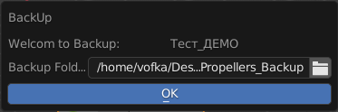

.. _backup-page:

Бекап проектов
=======================

Команда запуска:
----------------
.. code-block:: python

   bpy.ops.cerebro.backup_panel('INVOKE_DEFAULT')

Команда запускает панель в которой сперва надо указать путь где будут создаваться бекапы.

* Путь сохраняется при следующих запусках.
* История с этим путём аналогична указанию рабочего пути к :ref:`projects_folder_settings`, отличается только названием конечной директории.
* Клик по :guilabel:`OK` запустит процесс. Записи в БД будут не только создаваться, но и обновляться по текущему состоянию.

Обязательные услови
--------------------

* Пользователь должен быть авторизован
* Проект должен быть активен.

Структура бекапа
-----------------

* Для каждого проекта в ``BACKUP_FOLDER`` создаётся директория по **имени** проекта.

   .. attention:: При переименовании проекта бекап будет загружаться заново в новую директорию по новому имени проекта.

* Каждая бекап директория проекта содержит файл базы данных ``backup_data.db`` и директорию ``attachments``.

   .. image:: ../../../../_static/images/backup_folder.png

backup_data.db
~~~~~~~~~~~~~~~

тип БД:
********

``Sqlite3``

Таблицы
*********

.. code-block:: python

   TABLES={
      "Statuses":[
         'id INTEGER PRIMARY KEY',
         'name TEXT',
         'description TEXT',
         'color INTEGER',
      ],
      "Activities":[
         'id INTEGER PRIMARY KEY',
         'name TEXT',
         'color INTEGER',
      ],
      "Users":[
         'id INTEGER PRIMARY KEY',
         'login TEXT',
         'email TEXT',
         'first_name TEXT',
         'last_name TEXT',
         'full_name TEXT',
         'phone TEXT',
      ],
      "Tasks":[
         'id INTEGER PRIMARY KEY',
         'activity_id INTEGER', #Идентификатор вида деятельности.
         'activity_name TEXT', #Имя вида деятельности.
         'allocated TEXT', #Назначенные пользователи (исполнители) на задачу. Тип string. Разделитель „;“. USER_DATA_FULL_NAME
         'budget FLOAT', #Бюджет задачи с её подзадачами.
         'cc_status INTEGER', #Рассчитанный статус задачи. Рассчитанный статус может отличатся от собственного, поскольку он может быть унаследован от контейнера. Рассчетный статус является актуальным статусом задачи.
         'created TIMESTAMP', #Время создания задачи.
         'creator_id INTEGER', #Идентификатор автора задачи.
         'duration FLOAT', #Рассчитанная длительность задачи в днях. Тип float.
         'human_finish FLOAT', #Заданное время окончания задачи в днях от 01.01.2000. Тип float.
         'human_start FLOAT', #Заданное время начала задачи в днях от 01.01.2000. Тип float.
         'moderator_id INTEGER', #Идентификатор пользователя, изменившего задачу.
         'modified TIMESTAMP', #Время изменения задачи.
         'mtm TIMESTAMP', #Время модификации данных.
         'name TEXT', #Имя задачи.TIMESTAMP
         'offset FLOAT', #Рассчитанное время начала задачи в днях от 01.01.2000. Тип float.
         'parent_id INTEGER', #Идентификатор родительской задачи.
         'parent_url TEXT', #Полный путь до родителькой задачи. Пример: /Test project/Scene 1/
         'planned FLOAT', #Запланированное время на задачу в часах. Тип float.
         'priority INTEGER', #Приоритет задачи.
         'privilege INTEGER', #Права доступа текущего пользователя к задаче. Тип integer.
         'progress FLOAT', #Прогресс задачи. Тип float, от 0.0 до 100.0.
         'project_id INTEGER', #Идентификатор проекта задачи.
         'resource_approved FLOAT', #Принятое время материальных ресурсов по задаче с её подзадачами в часах. Тип float.
         'resource_declared FLOAT', #Заявленное время материальных ресурсов по задаче с её подзадачами в часах. Тип float.
         'resource_self_approved FLOAT', #Принятое время материальных ресурсов по задаче в минутах. Тип float.
         'resource_self_declared FLOAT', #Заявленное время материальных ресурсов по задаче в минутах. Тип float.
         'self_budget FLOAT', #Бюджет задачи.
         'self_spent FLOAT', #Затраты (сумма платежей) по задаче.
         'self_status INTEGER', #Собственный статус задачи. Статус установленный пользователем.
         'self_users_approved FLOAT', #Принятое время пользователей по задаче в минутах. Тип float.
         'self_users_declared FLOAT', #Заявленное время пользователей по задаче в минутах. Тип float.
         'spent FLOAT', #Затраты (сумма платежей) по задаче с её подзадачами. Тип float.
         'users_approved FLOAT', #Принятое время пользователей по задаче и её подзадачам в часах. Тип float.
         'users_declared FLOAT', #Заявленное время пользователей по задаче и её подзадачам в часах. Тип float.
      ],
      "Messages":[
         'id INTEGER PRIMARY KEY',
         'approved_time INTEGER', # Принятое время в минутах.
         'created TIMESTAMP', # Время создания сообщения.
         'creator_id INTEGER', # Идентификатор автора сообщения.
         'creator_name TEXT', # Имя автора сообщения.
         'moderator_id INTEGER', # Идентификатор пользователя, изменившего сообщение.
         'moderator_name TEXT', # Имя пользователя, изменившего сообщение.
         'mtm TIMESTAMP', # Время модификации данных.
         'pid INTEGER', # Идентификатор родительского сообщения.
         'status_id INTEGER', # Идентификатор статуса.
         'text TEXT', # Текст сообщения в формате HTML.
         'tid INTEGER', # Идентификатор задачи, к которой относится сообщение.
         'type INTEGER', # Тип сообщения. 
         'work_time INTEGER', # Рабочее время в минутах.
         'xmtm TIMESTAMP', # Реальное время модификации данных.
      ],
      "Attachments":[
         'id INTEGER PRIMARY KEY',
         'group_id INTEGER', # Идентификатор вложения.
         'comment TEXT', # Комментарий к файлу.
         'created TIMESTAMP', # Время создания.
         'del INTEGER', # Если значение этого поля не равно 0, значит вложение удалено.
         'event_id INTEGER', # Идентификатор сообщения.
         'file_name TEXT', # Идентификатор сообщения.
         'file_size INTEGER', # Размер файла вложения в байтах.
         'hash TEXT', # Хеш файла.
         'mtm TIMESTAMP', # Время модификации данных.
         'tag INTEGER', # Тип файла вложения.
      ],
      "Links":[
         'id INTEGER PRIMARY KEY',
         'del BOOL', # Если значение этого поля равно True, значит связь удалена.
         'dst INTEGER', # Задача, к которой идет связь.
         'mtm TIMESTAMP', # Время модификации данных.
         'src INTEGER', # Задача, от которой идет связь.
      ]
   }

attachments
~~~~~~~~~~~~~~~

Содержит директории, названные по ``id`` аттачмента. Содержимое каждой директории - файл этого аттачмента.
