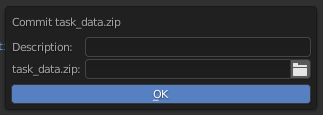

.. _commit-zip-page:

Коммит task_data.zip
=======================

Создаст коммит из ранее скаченного файла *task_data.zip* для случаев если надо перенести из проекта в проект какой-либо ассет.

Команда запуска:

.. code-block:: python

   bpy.ops.cerebro.commit_zip('INVOKE_DEFAULT')

Условия:

* Должна быть выполнена авторизация пользователя в плагине.
* Должна быть активна задача в которую делается загрузка.

Запускаемая командой панель:

* Надо написать короткий коментарий в *Description* 
* и выбрать файл *task_data.zip* в проводнике который открывается в соответсвующем поле.