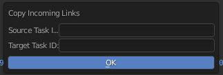

.. _copy-incoming-links-page:

Копирование входящих связей между задачами или ассетами
========================================================

Копируются связи из одной задачи или ассета в другую.

Команда запуска:
-----------------

.. code-block:: python

   bpy.ops.cerebro.copy_incoming_links("INVOKE_DEFAULT")

Условия:
---------

* Должна быть выполнена авторизация пользователя в плагине.

Запускаемая командой панель:
-----------------------------

* В поле **Source task ID** надо указать ``id`` ассета или задачи чьи входящие связи копируются.

* В поле **Target task ID** надо указать ``id`` задача или ассет назначения.

Как получить ``id`` ассета или папки:

   Простым копированием в адресной строке браузера, только надо убедится, что активна именно эта задача или ассет.

   .. image:: ../../../../_static/images/get_folder_id.png

