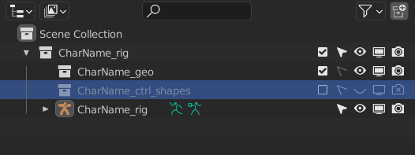

.. _rigging-page:

Риггинг
=======

Тех требования
----------------

Редактирование рига
~~~~~~~~~~~~~~~~~~~~

.. attention:: Редактирование рига всегда должно делаться так, чтобы никогда не ломалась созданная с ним анимация.

    Никогда не меняются:

        * Имена контролов.

        * Расположение контролов.
        
        * Положение геометрии относительно костей.

        * Дополнительные анимируемые атрибуты.

Требования к геометрии
~~~~~~~~~~~~~~~~~~~~~~~

#. Общие требования к геометрии, расположению, именам, текстурам описаны тут :ref:`modelling-page`

#. Каждый объект геометрии должен принадлежать только одной коллекции. Иначе оверрайд может создавать дубли объектов.

    .. attention:: Объект добавляемый на арматуру не должен добавлятся в коллекцию арматуры.

    .. image:: ../../_static/images/rig_tech_rules_geo_collection.png

Иерархия сцены рига
~~~~~~~~~~~~~~~~~~~~

#. Название ``root`` коллекции должно быть ``[AssetName]_rig``.

    * Команда для переименования ``root`` коллекции:

        .. code-block:: python

            import os; bpy.context.collection.name=f"{os.environ['CEREBRO_B3D_CURRENT_ASSET_NAME']}_rig"

        * выделяется коллекция в аутлайнере и выполняется данная команда в python консоле блендера (запуск консоли ``Shift+F4`` в любом окне блендера).

        .. attention:: Только одна коллекция может иметь в своём названии ``rig``.

#. ``root`` коллекция геометрии ``[AssetName]_geo`` размещается целиком в ``root`` коллекции рига.

    * у данной коллекции отключается выделение.

#. Коллекция ``[AssetName]_ctrl_shapes`` содержит всю геометрию для шейпов контролов рига.

    * у данной коллекции отключены все отображения и выделение.

#. Объект рига имеет название ``[AssetName]_rig`` и располагается напрямую в коллекции ``[AssetName]_rig``.

#. Все прочие вспомогатеьные объекты (камеры, свет, бекапы), которые не должны присутствовать с ригом в шоте - должны быть за пределами ``root`` коллекции рига ``[AssetName]_rig``.

Скрипты
~~~~~~~~~

#. Активные (самозапускаемые) скрипты, должны использоваться, только при крайней необходимости.

    * Весь ``сахар`` гуи объектов ради красоты не допустим. Это приводит к нестабильности сцен.