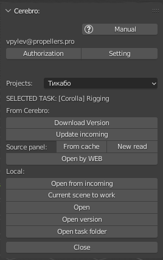

.. _work-selected-panel-page:

Selected Panel (Working)
========================

Панель отображаемая при выборе задачи из списка, до взятия в работу.

`Selected panel (видео) <https://youtu.be/Iav8T8ZGc5A>`_

.. _selected_panel_from_cerebro:

From Cerebro:
-------------

Группа кнопок для взаимодействия с *Cerebro*.

.. _selected_panel_download_version:

Download version
~~~~~~~~~~~~~~~~

:guilabel:`Download version` - Загрузка версии активной задачи с *Cerebro* на локальный компьютер пользователя.

.. _selected_panel_update_incoming:

Update incoming
~~~~~~~~~~~~~~~

:guilabel:`Update incoming` - Загрузка с *Cerebro* недостающих входящих компонентов для активной задачи.

.. _selected_panel_source_panel:

Sources panel
~~~~~~~~~~~~~

:guilabel:`Sources panel` - открытие панели где возможны загрузка компонентов исходников в сцену, а так же перезагрузка версий исходников. Полное описание см. тут :ref:`work_panel_source_panel`

.. _selected_panel_open_last_commit_by_web:

Open by WEB
~~~~~~~~~~~

:guilabel:`Open by web` - Открывает страницу задачи в вёб браузере.

.. _selected_panel_local:

Local:
------

*	Группа кнопок взаимодействия с локальными весриями активной задачи.
*	Все кнопки предполагают какое-либо открытие рабочего файла и взятие его в работу.
*	Во все случаях:

	*	открыта будет **top** версия рабочего файла.
	*	статус задачи будет изменён на ``в работе``, при наличии другой задачи в таком статусе, она будет поставлена на паузу.
	*	будет открыта :ref:`work-panel-page`

.. _selected_panel_open_from_incoming:

Open from incoming
~~~~~~~~~~~~~~~~~~

`(видео) <https://disk.yandex.ru/i/6ny5sR3aJ8KjMA>`_

:guilabel:`Open from incoming` - Взятие в работу топ версии рабочего файла входящей задачи. Для случаев когда надо забрать рабочий файл целиком из входящей задачи в текущую.

* Клик по кнопке откроет список входящих задач из этого же ассета. 

	.. image:: ../_static/images/open_from_incoming_tasks_list.png

	* список содержит имена задач и статус "свежести" версии
		
		* при необходимости загрузить последнюю версию файла входящей задачи можно в :ref:`selected_panel_source_panel` выполнив :guilabel:`Reload version`.

		* если же загружаемая сцена составная (локация, шот) и какие-либо из её компонентов (пропсы, персонажи, локация) могут отсутствовать то можно выполнить :ref:`selected_panel_update_incoming` 

	* клик по кнопке :guilabel:`Open`:

		* скопирует файл из входящей задачи в **топ** версию текущей.
		* изменит статус задачи на ``в работе``
		* Будет открыта :ref:`work-panel-page`

	.. note:: Пути на текстуры при этом будут ссылаться на исходную задачу, чтобы забрать текстуры надо воспользоваться функцией :ref:`work_panel_collect_textures`

.. _selected_panel_current_scene_to_work:

Current scene to work
~~~~~~~~~~~~~~~~~~~~~

:guilabel:`Current scene to work` - Взятие в работу текущей открытой сцены, с копированием в **top** версию активной задачи. Для случаев когда работа над файлом велась вне аддона, и пришло время загрузить версию на *Cerebro*.

* Кроме сохранения самой сцены, забираются её текстуры из ``/textures``, а так же находящихся за пределами :ref:`projects_folder_settings`.

* Если данный файл уже является **top** версией данной задачи, то копирования файла производиться не будет.
* Будет открыта :ref:`work-panel-page`

.. attention:: **top** версия рабочего файла будет перезаписана, если не был сделан :ref:`work_panel_commit` данные не сохранятся.

.. _selected_panel_open:

Open
~~~~

:guilabel:`Open` - Открытие **top** версии активной задачи.

* Будет открыта :ref:`work-panel-page`

.. _selected_panel_open_version:

Open version
~~~~~~~~~~~~

:guilabel:`Open version` - Открытие локальной версии активной задачи по выбору.

* Будет открыта :ref:`work-panel-page`

.. attention:: **top** версия рабочего файла будет перезаписана, если не был сделан :ref:`work_panel_commit` данные не сохранятся.

.. _selected_panel_open_task_folder:

Open task folder
~~~~~~~~~~~~~~~~

:guilabel:`Open task folder`

Запуск проводника в папке данной задачи.

Close
-----

:guilabel:`Close` - вернёт на :ref:`tasks-list-page`