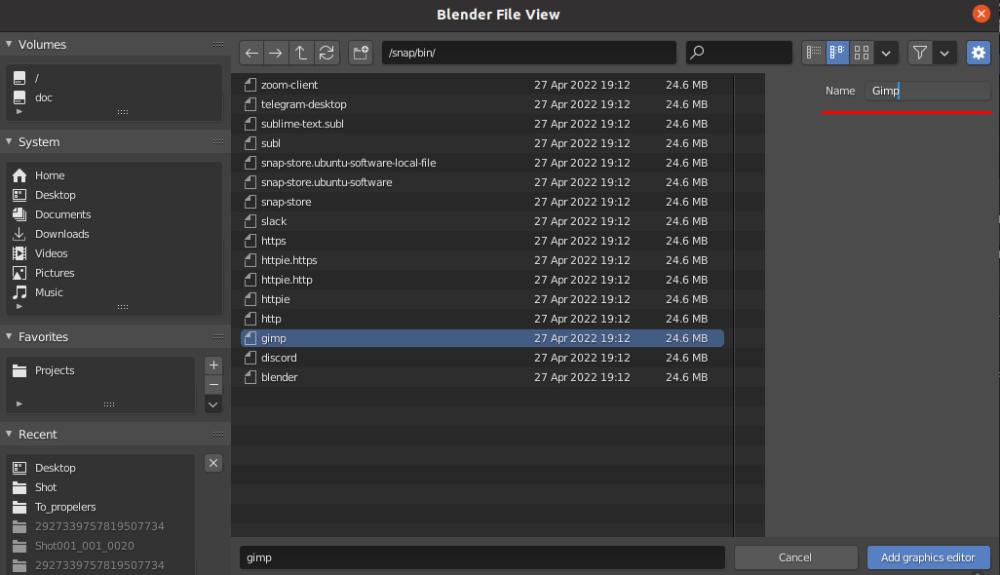

.. _manual-settings-page:

Настройки
=========

* Панель настроек запускается кнопкой :guilabel:`Setting` в панели аддона.

.. _projects_folder_settings:

Директория для проектов
-----------------------

Все рабочие файлы и мета данные аддон будет искать в директории, определённой в настройках **Projects Dir**

.. image:: ../_static/images/projects_dir_setting.png

* При этом название самой директории **Cerebro_Projects_Main**, она будет создана в указанной директории.

* Если выбрать саму директорию **Cerebro_Projects_Main** то ничего создаваться не будет и эта директория станет рабочей.

.. note:: Можно иметь любое количество таких директорий для разных проектов и текущих состояний, и переключаться между ними.

Обновление
-----------

* :guilabel:`Проверить наличие обновлений` - запустит проверку наличия обновлений. Подробнее в :ref:`update-page`

Выбор графических редакторов
----------------------------

:guilabel:`Add graphics editor` - Добавление графических редакторов в список, для дальнейшего использования их при редактировании текстур :ref:`work_panel_edit_textures`.

Для того чтобы добавить графический редактор надо выбрать его экзешник в проводнике и указать имя под которым он будет отображаться в списке: поле ``Name`` (если не указывать имя, оно будет создано по названию экзешника с заглавной буквы).

