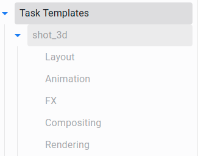

.. _tasks-templates-page:

Шаблоны задач
=============

Шаблоны используются для создания задач при автоматической генерации ассетов.

* Шаблон представляет из себя родительскую задачу с подзадачами,

	* Родительские задачи шаблона должны распологатся сразу под верхней задачей проекта *Task Templates*.

	* Между подзадачами установливаются связи.

	* Имена родительских задач шаблонов отображаются в списке шаблонов плагина.

* При создании ассета будут использованы: 

	* тип родительской задачи шаблона - станет типом создаваемого ассета.

	* подзадачи:

		* имена,
		* типы,
		* внутренние связи.

* Использование шаблонов при генерации ассетов:

	* :ref:`animatic_tools_make_shots`