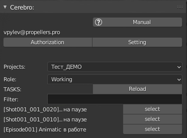

.. _tasks-list-page:

Tasks List
==========

Список задач назначенных на текущего пользователя, отображаемый при выборе проекта.

.. _tasks_list_projects:

Projects:
~~~~~~~~~

Раскрывающийся список проектов данной студии, список задач перезагружается при смене проекта.

.. _tasks_list_role:

Role:
~~~~~

Роли для взаимодействия с задачами, на выбор две роли ``Working`` и ``Cheking``.

* ``Working`` - отображается список задач для которых текущий пользователь назначен в качестве исполнителя.

	* статусы отображаемых задач все кроме завершённых.

* ``Cheking`` - отображается список задач на которые подписан текущий пользователь.
	
	* задачи отображаются в статусе *"на проверку"*.

.. _reload_tasks_list_button:

Reload button
~~~~~~~~~~~~~

:guilabel:`Reload` - перезагружает список задач текущего проекта.

.. _tasks_list_filter:

Filter:
~~~~~~~

Текстовое поле для ввода, учитывается соответствие с именованием ассета, задачи или статуса задачи.

.. _tasks_list_select_button:

Select button
~~~~~~~~~~~~~

:guilabel:`select` - Кнопка напротив каждой задачи. Откроет :ref:`work-selected-panel-page` или :ref:`check-selected-panel-page` данной задачи в зависимости от :ref:`tasks_list_role`.