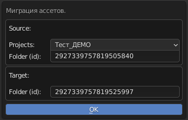

.. _assets-migration-page:

Миграция ассетов
===================

Перенос ассетов какой-либо директории из одного проекта в другой, или внутри проекта.

* Копируются ассеты с задачами.
* Для каждой задачи переносится архив *task_data.zip* последнего коммита вместе с коментарием.
* В директории *~/.cerebro_b3d_connect/* создаётся файл *recovery.json* содержащий соотношения ``id`` исходных и вновь созданных задач и ассетов.

Команда запуска:

.. code-block::

   bpy.ops.cerebro.assets_migrate('INVOKE_DEFAULT')

Условия:

* Должна быть выполнена авторизация пользователя в плагине.
* Директория источник должна содержать только ассеты (не папки и не задачи).

Запускаемая командой панель:

* В боксе **Source** надо выбрать проект и указать ``id`` директории из которых идёт копирование.

* В боксе **Target** надо указать ``id`` директории назначения (проект может быть любым).

Как получить ``id`` директории:

   Простым копированием в адресной строке браузера, только надо убедится, что активна именно эта директория.

   .. image:: ../../_static/images/get_folder_id.png

