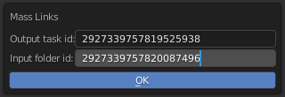

.. _mass-links-page:

Множественные ссылки
=====================

Связь одного ко многоим, связывает задачу или ассет со всеми подзадачами какой-либо директории. Нпример связать локацию со всеми шотами директории "Shots" эпизода.

Команда запуска:
-----------------

.. code-block::

   bpy.ops.cerebro.mass_links("INVOKE_DEFAULT")

Условия:
---------

* Должна быть выполнена авторизация пользователя в плагине.

Запускаемая командой панель:
-----------------------------

* В поле **Output task id** надо указать ``id`` ассета или задачи из которых идёт связь.

* В поле **Input folder id** надо указать ``id`` директории назначения.

Как получить ``id`` ассета или папки:

   Простым копированием в адресной строке браузера, только надо убедится, что активна именно эта директория или ассет.

   .. image:: ../../_static/images/get_folder_id.png

.. note:: Процесс может оказаться длительным, лучше всего наблюдать за его ходом через системную консоль (терминал).

