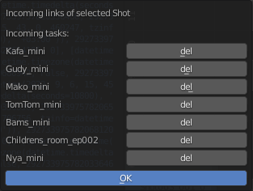

.. _remove-incoming-links-from-shot-page:

Удаление входящих связей из шота
=================================

Выборочное удаление входящих связей для выбранного шота в редакторе секвенций аниматика.

* `Видео <https://disk.yandex.ru/i/hf5IFgzAFNDX3A>`_

Команда запуска:
-----------------

.. code-block::

   bpy.ops.cerebro.remove_incoming_links_from_selected_shot_panel("INVOKE_DEFAULT")

Условия:
---------

* Должна быть выполнена авторизация пользователя в плагине.

* Работа производится в задаче аниматика в *Sequence Editor* с выбранной дорожкой шота.

Запускаемая командой панель:
-----------------------------

* Кнопка :guilabel:`del` удалит данную входящую связь из шота и очистит данную строку в списке.

