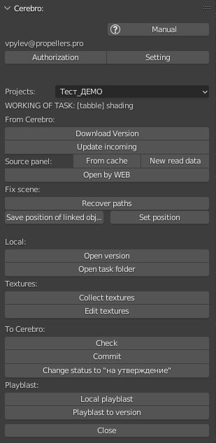

.. _work-panel-page:

Working Panel
=============

Панель отображаемая когда файл активной задачи находится в работе.

`Work panel (видео) <https://youtu.be/43lPkwNfywU>`_

.. _work_panel_from_cerebro:

From Cerebro:
--------------

Группа кнопок получения данных с *Cerebro* полностью аналогична :ref:`selected_panel_from_cerebro`

.. _work_panel_download_version:

Download version
~~~~~~~~~~~~~~~~

:guilabel:`Download version` - Загрузка версии активной задачи с *Cerebro* на локальный компьютер пользователя, полностью аналогична :ref:`selected_panel_download_version`

.. _work_panel_update_incoming:

Update incoming
~~~~~~~~~~~~~~~

:guilabel:`Update incoming` - Загрузка с *Cerebro* недостающих входящих компонентов для активной задачи, полностью аналогична :ref:`selected_panel_update_incoming`

.. _work_panel_source_panel:

Sources panel
~~~~~~~~~~~~~

   .. image:: ../_static/images/source_panel_variants.png

   Панель где возможны загрузка в сцену контента, а так же перезагрузка версий контента.

   Возможны два варианта:

   :guilabel:`From cache` - панель открывается из кеша без чтения базы данных.

   .. note:: Кеш заполняется при открытии вторым вариантом и при выполнении :ref:`work_panel_update_incoming`
   
   :guilabel:`New read data` - открытие панели с получением данных из сети, с кешированием полученных данных.

   Запускаемая панель:

   .. image:: ../_static/images/source_panel.png

   Столбцы панели в порядке следования слева на право: 

   #. имя ассета
   #. имя задачи
   #. свежесть версии (*missing*, *old*, *latest*)
   #. кнопка :guilabel:`Add`
   #. кнопка :guilabel:`Reload version`

   :guilabel:`Add` - активна только приналичии какой либо версии, откроет список коллекций файла версии и две возможности загрузки, сделать ``Owerride`` или ``Append``.

   .. image:: ../_static/images/source_panel_add_panel.png

   * В панели так же имеется фильтр по наименованию коллекции, можно вводить несколько поисковых слов через пробелл.

   :guilabel:`Reload version` - откроет список версий входящей задачи на сервере с возможностью загрузки.

   .. image:: ../_static/images/source_panel_reload_versio_panel.png

   Клик по кнопке :guilabel:`Download` загрузит указанную версию на компьютер пользователя. Данная загрузка не локализуется текущей задачей, а будет доступна для всех задач которые ссылаются на этот исходник.

.. _work_panel_open_last_commit_by_web:

Open by WEB
~~~~~~~~~~~

:guilabel:`Open by web` - Открывает страницу задачи в вёб браузере.

.. _work_panel_fix_scene:

Fix scene:
----------

Панель переходного периода из *Ftrack*

Recover paths
~~~~~~~~~~~~~

Замена путей библиотек после переезда из *Ftrack*.

:guilabel:`Recover paths` - откроет проводник где надо выбрать файл *recover.json* созданный при бекапе проекта.

Save position of linked objects
~~~~~~~~~~~~~~~~~~~~~~~~~~~~~~~

:guilabel:`Save position of linked objects` - Сохраняет в текстовый файл положения линкованных объектов и соответствующие им анимационные экшены.

Set position
~~~~~~~~~~~~

:guilabel:`Set position` - применяет из текстового файла положения линкованных объектов и соответствующие им анимационные экшены, анимационные экшены должны присутствовать в сцене.

.. _work_panel_local:

Local:
------

Группа кнопок взаимодействия с локальными весриями активной задачи.

.. _work_panel_open_version:

Open version
~~~~~~~~~~~~

:guilabel:`Open version` - Открытие локальной версии активной задачи по выбору.

.. attention:: **top** версия рабочего файла будет перезаписана, если не был сделан :ref:`work_panel_commit` данные не сохранятся.

.. _work_panel_open_task_folder:

Open task folder
~~~~~~~~~~~~~~~~

:guilabel:`Open task folder` - Запуск проводника в папке данной задачи.

.. _work_panel_textures:

Textures:
---------

.. _work_panel_collect_textures:

Collect textures
~~~~~~~~~~~~~~~~

:guilabel:`Collect textures` - Сборка текстур с перезаписью путей, в директорию **textures** активной задачи. 

`Collect textures (видео) <https://youtu.be/iTCtTxtwsns>`_

.. _work_panel_edit_textures:

Edit textures
~~~~~~~~~~~~~

:guilabel:`Edit textures` - Открытие графического редактора для редактирования текстур из директории **textures** активной задачи.

`Edit textures (видео) <https://youtu.be/pwS9yW_cA9s>`_

.. _work_panel_tech_functions:

Специфичные для типов задач панели:
-----------------------------------

.. toctree::
   :maxdepth: 1

   work_panel/animation_tools
   work_panel/animatic_tools
   work_panel/build_scene
   work_panel/render_tools

.. _work_panel_to_cerebro:

To Cerebro:
------------

.. _work_panel_check:

Check
~~~~~

:guilabel:`Check` - Проверка текущей сцены на соответствие с требованиями для данного типа задачи.

* При обнаружении несоответствий, будет запущено информационное окно.

   .. image:: ../_static/images/check_window.png

* :guilabel:`select` - кнопка на против каждого неисправного объекта в информационном окне:

      * Выделит объект, если он выделяем.

      * Создаст запись в ``Info`` панели или терминале, где можно скопировать имя объекта для поиска в ``Outliner`` или ``Image Editor`` если это текстура.

      .. image:: ../_static/images/check_wrong_info_panel.png

.. _work_panel_commit:

Commit
~~~~~~

:guilabel:`Commit` - Фиксация изменений **top** версии, создание новой локальной версии, запуск фоновой загрузки версии на *Cerebro*.

.. note:: коммит использует именно *top* версию, если текущая сцена была по каким-то целям переименована, то её надо переименовать обратно как топ версию - ``AssetName.blend``

* Если поставить галочку ``To Review`` то статус задачи изменится на *на утверждение* при этом будет выполнена процедура :ref:`work_panel_check`.

.. image:: ../_static/images/commit_to_review.png

* Для некоторых задач панель коммита содержит галочку ``Push to cerebro``, если её снять то версия не будет отправляться на сервер, а будет только локальной.

.. image:: ../_static/images/commit_push_to_cerebro.png

.. _work_panel_change_status_to_pending_review:

Change status to "на утверждение"
~~~~~~~~~~~~~~~~~~~~~~~~~~~~~~~~~

:guilabel:`Change status to "на утверждение"` - Изменение статуса на *на утверждение* без создания версии.

.. _work_panel_playblast:

Playblast:
----------

Создание и отправка версий плейбластов на *Cerebro* с настройками проекта и шота.

.. image:: ../_static/images/working_panel_playblast.png

.. _work_panel_playblast_local_playblast:

Local playblast
~~~~~~~~~~~~~~~

:guilabel:`Local playblast` - Создание плейбласта без отправки версии, но с сохранением по настройкам.

.. note:: Автоматически выставляются настройки **output** но тайминг на совести аниматора.

.. _work_panel_playblast_playblast_to_version:

Playblast to version
~~~~~~~~~~~~~~~~~~~~

:guilabel:`Playblast to version` - Создание версии с плейбластом.

Параметры всплывающего диалога:

* **Status to "на утверждение"** - назначение статуса задачи, по умолчанию ``True``, если снять галочку то статус задачи не изменится.

* **Use latest playblast** - создаст версию с последним сохранённым плейбластом созданным в :ref:`work_panel_playblast_local_playblast`.

* **Description** - обязательное для заполнения поле с кратким комментарием для данной версии.

* **Make commit** - если ``True`` то будет так же сделан и :ref:`work_panel_commit`, по умолчанию ``True``.

.. note:: Автоматически выставляются и настройки **output** и тайминг шота.

Close
-----

:guilabel:`Close` - вернёт на :ref:`tasks-list-page`