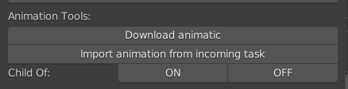

.. _animation-tools-page:

Animation tools
===============

Функционал для работы с анимацией.

.. _animation_tools_download_animatic:

Download animatic
~~~~~~~~~~~~~~~~~

:guilabel:`Download animatic` - Загружает из *Cerebro* последнюю версию видеофайла аниматика в директорию задачи.

* Создаёт секвенции с мувкой и звуком на 1-ой и 2-ой дорожках секвенсора.
* Выставляет временной диапазон сцены:
    * старт из параметра ``Frame Start`` проекта, а финиш по длительности.
* Отображает аниматик на фоне камеры шота в верхнем правом углу, с прозрачностью 0,5.

    .. image:: ../../_static/images/animatic_bg_images.png

.. _import_animation_from_incoming_task:

Import animation from incoming task
~~~~~~~~~~~~~~~~~~~~~~~~~~~~~~~~~~~~~~

Импорт анимации из входящей задачи.

* Забирается анимация и полностью заменяется коллекция **Excipients**.

.. _animation_tools_child_of_on_off:

Child OFF
~~~~~~~~~~~

`Видео <https://disk.yandex.ru/i/a6lloZysHRQzuw>`_

Постановка ключей на включение-отключение констрейна **Child_of**, а так же на сам контрол, таким образом, чтобы анимация 
восстанавливалась при :ref:`build-scene-page`.

Кнопки :guilabel:`ON` :guilabel:`OFF`