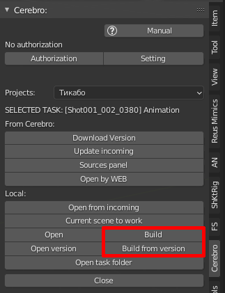

.. _build-scene-page:

Build Scene
===============

Сборка анимационных сцен из исходников.

----------------------------

Используется для первоначальной сборки анимационных шотов при отсутствии какой-либо анимации, или для восстановления анимационных шотов в случаях когда "ломаются" оверрайды из за редактирования исходников (локация, пропсы ,персонажи)

Симпотмы поломок:

    * риги на месте, а геометрия в центре координат.

    * зависает открытие сцены.

    * сцена падает при открытии.

Иногда причиной поломки может быть устаревший контент на вашем локальном компьютере, в том случае когда контент имеет более свежие версии и данный шот сохранялся где-то с более свежим контентом.

    * в этом случае стоит сделать :ref:`selected_panel_update_incoming` - если поможет то билд делать не нужно.

----------------------------

Build scene video1_

Build scene при отсутствии commit_data.json video2_

.. _video1: https://disk.yandex.ru/d/odWN6S6m7nBcbQ

.. _video2: https://disk.yandex.ru/i/hChfAc7wYBup_Q

* Перед сборкой:

    * сделать :ref:`selected_panel_update_incoming`.

    * полностью очистить сцену.

    * включить *Simmplify* с нулём.

* Источники данных:

    * контенет - ассеты по входящим связям, можно увидеть в :ref:`selected_panel_source_panel`.

    * положения объектов, именования экшенов и параметры камеры - текстовый файл ``//meta/commit_data.json``.

        * создаётся при каждом коммите (упаковывается в версию) или загружается с версией при :ref:`selected_panel_download_version`.

        * .. note:: данные файлы начали создаваться в коммитах после 09.08.2022.

    * анимационные экшены - либо из бленд файла топ версии, или из указанной версии.

