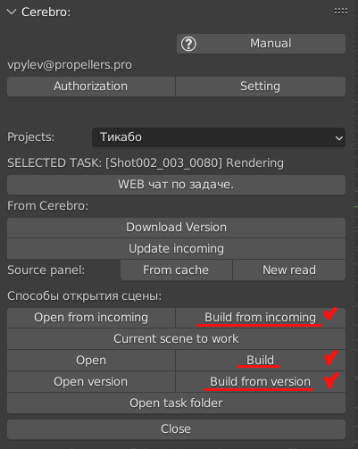

.. _build-scene-page:

Build Scene
===============

Сборка анимационных сцен из исходников.

`Build scene <https://disk.yandex.ru/d/odWN6S6m7nBcbQ>`_

`Билд сцены при отсутствии commit_data.json <https://disk.yandex.ru/i/hChfAc7wYBup_Q>`_

* Перед сборкой:

    * сделать :ref:`selected_panel_update_incoming`.

    * полностью очистить сцену.

    * включить *Simmplify* с нулём.

* Источники данных:

    * контенет - ассеты по входящим связям, можно увидеть в :ref:`selected_panel_source_panel`.

    * положения объектов, именования экшенов и параметры камеры - текстовый файл ``//meta/commit_data.json``.

        * создаётся при каждом коммите (упаковывается в версию) или загружается с версией при :ref:`selected_panel_download_version`.

        * .. note:: данные файлы начали создаваться в коммитах после 09.08.2022.

    * анимационные экшены - либо из бленд файла топ версии, или из указанной версии.

