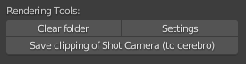
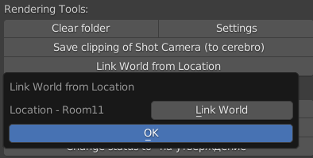

.. _render-tools-page:

Render Tools
===============

Доп функционал для задач c видоим деятельности ``render``.

Clear folder
-------------

:guilabel:`Clear folder` - удаляет содержимое из папки ``render_output`` в директории задачи.

Settings
---------

:guilabel:`Settings` - выставляет основные настройки и прописывает пути.

* Выставляет высоту, ширину кадра и fps из параметров проекта.

* Выставляет тайминг по параметрам шота.

* Выставляет ``clip_start``, ``clip_end`` текущей камеры по параметрам шота.

* Прописывает пути во всех нодах **file_output** по шаблонам:
    
    * для **OPEN_EXR_MULTILAYER**: 

        * в параметре ``base_path`` : //render_output/ v ``N`` / ``AssetName`` _ v ``N`` _ ``ThisNodeLabel`` _#####

        .. image:: ../../_static/images/exr_multilayer_node_path.png    

    * для остальных типов:

        * в параметре ``base_path`` : //render_output/ v ``N`` /

        * в ``file_slots[0].path`` : ``AssetName`` _ v ``N`` _ ``ThisNodeLabel`` _#####

        .. image:: ../../_static/images/png_node_path.png

    .. note:: где ``N`` - номер будущего коммита.

Save clipping of Shot Camera (to cerebro)
-----------------------------------------

:guilabel:`Save clipping of Shot Camera (to cerebro)` - сохранение в настройки шота параметров ``clip_start``, ``clip_end`` текущей камеры шота.

.. _link_world_from_location:

Link World from Location
-------------------------

Линкование ``World`` объектов из входящей локации шота.

:guilabel:`Link World from Location` - запустит панельку со списком входящих локаций данного шота (как правило одна)

:guilabel:`Link World` - залинкует все ``World`` объекты из этой локации.

.. _objects_to_render_collections:

Objects to render collection
------------------------------

Кнопка :guilabel:`Link World from Location` - добавляет коллекции выбранных объектов в коллекцию **Props_to_Render**

При отсутствии эта коллекция создаётся.