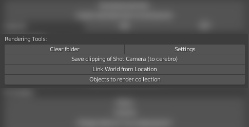

.. _render-tools-page:

Render Tools
===============

Доп функционал для задач c видоим деятельности ``render``.

Clear folder
-------------

:guilabel:`Clear folder` - удаляет содержимое из папки ``render_output`` в директории задачи.

Settings
---------

:guilabel:`Settings` - выставляет основные настройки и прописывает пути.

* Выставляет высоту, ширину кадра и fps из параметров проекта.

* Выставляет тайминг по параметрам шота.

* Прописывает пути в параметре ``base_path`` всех нод **file_output** по шаблону: ``AssetName`` _ v ``N`` _ ``ThisNodeLabel``

    * где ``N`` - номер будущего коммита.

